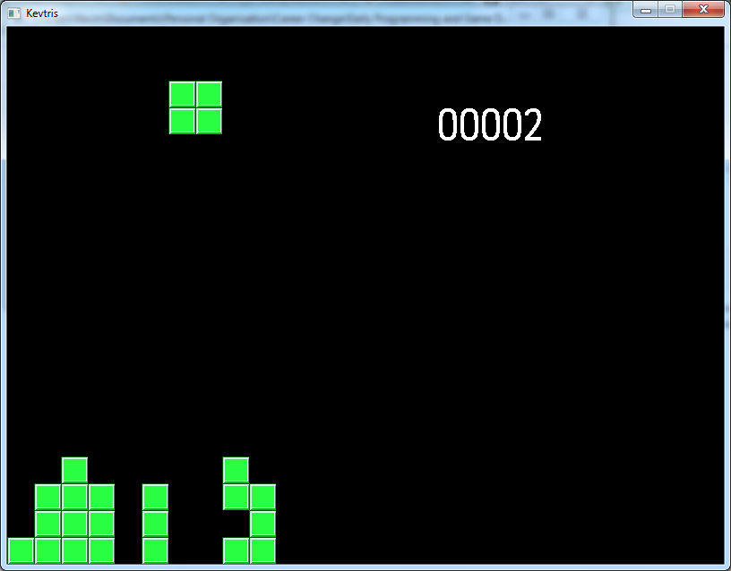

This code is from 2010. It was a learning project I took on while studying [Sams Teach Yourself C++ in 24 Hours.](http://workbench.cadenhead.org/book/cpp-24-hours/). It's a version of Tetris I named Kevtris, although the gameplay is unaltered from the classic.

A binary I compiled in 2010 looks like this in action:

Thanks for reading!

Kevin Higgins
22/08/19
